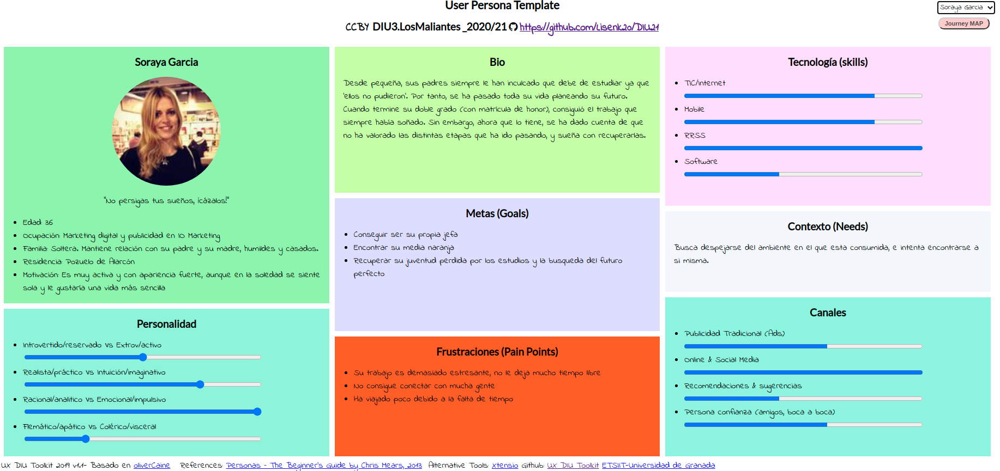

# DIU-Final
Trabajo Final Diseño Interfaces de Usuario 2020-21

>>> Rediseño de Yuzin, empresa de divulgación de eventos culturales.

Autor
 * :bust_in_silhouette:   Alejandro Cuenca Zurita     :octocat:     

-----

# Parte 1.

## Mi Experiencia UX 
-----
Para la parte de teoría, me voy a basar principalmente en los tres actividades entregables, ya que es a las que más esfuerzo le he dedicado (ya que eran evaluables) y porteriormente aplicaremos algunos de los conceptos y seminarios de teoría en prácticas.

>>> En primer lugar, comenzaré hablando sobre la primera tarea que se propuso en teoría: la actividad de etnografía. Y es que, aunque en un principio no capté la esencia ni la importancia que tenía un ejercicio como este (así como otras opciones para el desarrollo de un proyecto, como entrevistas con los clientes y usuarios del producto software), tras realizar el análisis de una actividad cotidiana de interacción con una entidad (la cual en mi caso fue el sensor de la vaya de un parking) me dí cuenta de que para desarrollar buenas interfaces de usuario y software que se adapte a los usuarios, es muy importante estudiar y realmente tener en cuenta cómo se relacionan e interactuan estos usuarios con los productos software, lo que me ha servido también para tenerlo más en cuenta en otras asignaturas como Desarrollo de Software y Sistemas de Información Basados en Web.
>>>
>>> Ahora pasamos al segundo ejercicio, el de usabilidad. En este caso, durante la realización del ejercicio me fui dando cuenta de lo importantes pero poco apreciables que son los detalles de diseño de interfaces, que pueden dar lugar a una buena experiencia de usuario que haga que el mismo no se sienta frustado al navegar por el sitio, o por el contrario, que dé lugar a una mala experiencia que haga que el usuario esté descontento. Entre los atributos más destacables para mejorar esta experiencia de usuario y usabilidad pueden estar el uso de un menú que, siendo suficientemente detallado, sea a su vez sencillo y que no nos haga perdernos más que encontrar lo que deseamos, y también que el número de clicks que nos lleven hasta una opción interesante dentro de la página sea el mínimo. Es decir, buscamos llevar a cabo aplicaciones y diseños web que simplifiquen y den lugar a una buena usabilidad y experiencia por parte del usuario, evitando sobrecargas de información y diseños liosos cuyas opciones no puedan ser accedidas en pocos clicks.
>>>
>>> Por último, la actividad de accesibilidad, con la cual hemos aprendido a evaluar la accesibilidad de un sitio web,  así como tener en cuenta las pautas de WACG y la importancia de incluirlas en nuestros proyectos. De esta forma, me ha ayudado a entender mejor el uso de estas pautas y poder aplicarlas en otras asignaturas como SIBW, en la que tenemos que tener en cuenta estas pautas e incluirlas en nuestras prácticas, así como evaluar la accesibilidad de nuestro sitio de forma automática y manual, como hemos visto en esta actividad de accesibilidad. Pero además de esta evaluación, gracias al uso de herramientas que simulan distintas discapacidades, hemos podido tener una mejor idea de los diversos puntos de vista y problemas a los que se pueden enfrentar las distintas personas que visiten nuestras webs, dando lugar así a la creación de mejores productos software que puedan ser accesibles y cumplan con las regulaciones establecidas, para mejorar la experiencia (o intentarlo) de todos  los tipos de personas.

En cuanto a las prácticas:

> > >  En un inicio, un poco impresionado por la carga de trabajo que parecía venirse encima (comparación de diversas aplicaciones, el desarrollo completo de la UI de un aplicación propia, y el desconocimiento sobre cómo realizar una UI y sus pautas), no sabía qué esperar de estas prácticas ni cómo abordarlas. Sin embargo, tras finalizar todo el desarrollo de nuestra aplicación y seguir todos los pasos de diseño hasta ello, me he ido dado cuenta de la importancia de cuidar este desarrollo de las interfaces y de seguir las pautas y patrones de desarrollo para conseguir una experiencia de usuario óptima. Además de darme cuenta de que, gracias a la cantidad de información y herramientas disponibles, este desarrollo es más fácil y llevadero de lo que se puede pensar en un principio.
> > >
> > > De esta forma, me gustaría destacar algunos conceptos y herramientas que son los que, a mi juicio, más me han ayudado y permitido un buen desarrollo de nuestra interfaz. En primer lugar, destacamos la creación de dos personas ficticias, que nos permitirán pensar desde otros puntos de vista que, si no nos planteamos estas personas, podemos pasar por alto, por lo que estas personas ficticias dan lugar a una interfaz seguramente más completa. En segundo lugar, me gustó mucho el desarrollo de un site-map y los bocetos Lo-Fi, ya que estos nos dan una idea más clara de cómo queremos enfocar nuestra aplicación y la forma en la que la organizaremos, para así realizar un diseño más sencillo y tener más claro, sobretodo, cómo vamos a dar forma a nuestra app y su estructura. Posteriormente también me parece interesante el uso de un Moodboard, ya que nos lleva a investigar qué queremos transmitir con nuestra página, los colores que queremos usar (que determinarán también lo que expresamos con la interfaz), y organizar el diseño. Y este Moodboard (aparte de la multitud de otros pasos a llevar a cabo), nos llevará al diseño del Mockup de nuestro sitio web o aplicación, que dará la forma final a nuestro proyecto, y que fue interesante realizar ya que desconocía muchos de los patrones de diseño que se tienen que tomar en cuenta a la hora de realizar una aplicación, como los propios del Material Design, la forma en la que presentar los formularios para la entrada de datos, los inicios de sesión para los usuarios... Y por último, destacar el test A/B y el cuestionario SUS, que nos ayudará a la hora de evaluar productos software cuyo diseño puede ser mejorado y evaluar su rendimiento.
> > >
> > > De esta forma, creo que el desarrollo de las prácticas me ayudará mucho en un futuro para tener en cuenta todos estos patrones y principios a la hora de desarrollar mis propios proyectos, y aunque no sea un experto, pienso que seré capaz de llevar a cabo interfaces de usuario mucho más eficaces, que transmitan lo que deseo, y que den lugar a experiencias de usuario mucho más satisfactorias, lo que me beneficiará asimismo a conseguir mejor repercusión en estos posibles proyectos.

# Parte 2.

## Caso de estudio. Web Yuzin

#### 1. Descripción

En este caso realizaremos el rediseño de la página deb de Yuzin, una empresa dedicada a divulgar eventos culturales en Granada, así como en Sevilla. Mediante su página web podremos ver y reservar eventos que pueden ser publicados por los promotores culturales, siendo su objetivo hacer llegar a todo el mundo posibilidades culturales de una forma sencilla.

En el caso de la página web, se ofrece una breve información sobre eventos culturales, artículos de opinión y la opción de reservar en estos eventos.

#### 2. Persona

Para este análisis usaremos una persona ficticia que ya hemos usado en las prácticas de la asignatura. Esta persona se diseñó y verificó como posible usuario de cualquier tipo de aplicación, por lo que usaremos a Soraya García para realizar el análisis de Yuzin.

#### 3. Usability Review

Usaremos una plantilla para la revisión de la usabilidad de la web de Yuzin. El documento puede verse en [PDF](Usability.pdf)
