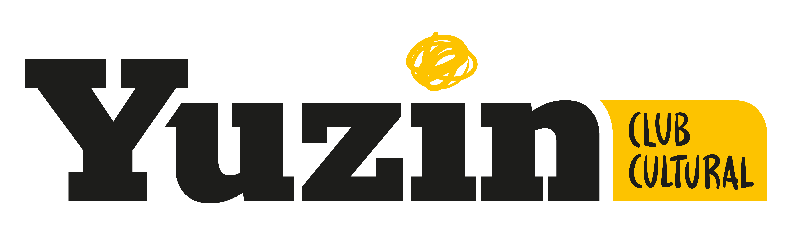

# DIU-Final
Trabajo Final Diseño Interfaces de Usuario 2020-21

>>> Rediseño de Yuzin, empresa de divulgación de eventos culturales.

Descripción: 

>>> Hola 

Logotipo: 

Autor
 * :bust_in_silhouette:   Alejandro Cuenca Zurita     :octocat:     

-----

# Proceso de Diseño 

## Paso 1. UX Desk Research & Analisis 

 1.a Competitive Analysis
-----

>>> Nuestra aplicación seleccionada ha sido **‘Airbnb’**. Tras investigar múltiples aplicaciones y páginas web que ofrecen oportunidades de ocio a sus usuarios (respetando las medidas pertinentes por la situación epidemiológica actual), hemos considerado que Airbnb es una candidata perfecta por su completitud y diseño. 
>>>
